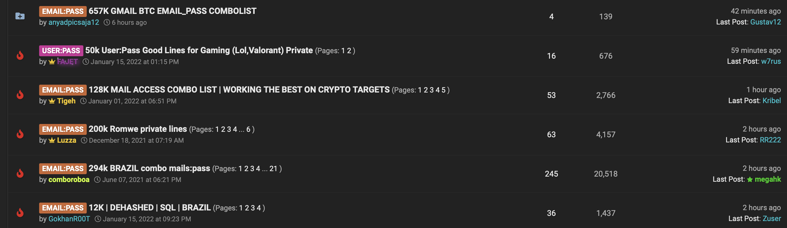

## What is cracking?
Cracking is a way that threat actors can gain access to accounts of nearly any platform. Hackers crack simple things like pizza accounts all the way to cryptocurrency exchange logins for profit.

## Combolist
Cracking is perpetrated through combolist. A combolist is a long list of emails and passwords, obtained via leaked databases.
Leaked databases are a result of companies being compromised and having their database of users along with their corresponding email and password breached. This can be done in many ways, but a very popular way is finding vulnerable sites and performing a 'SQL injection' on them. This results in the files from the database being breached, which typically contain user information.
These leaked databases are obviously very valuable, especially if they contain massive amounts of user data. Not all databases are equal, massive sites like LinkedIn have far more login credentials than a random local coffee website would have, thereby a LinkedIn database is worth more. Database sales can be found on nearly any darknet marketplace, one particularly active marketplace I came across is RaidForums.

In these leaked databases, the format is typically email:password, seperated by a colon to make the email and password readable by the software used to crack the logins.